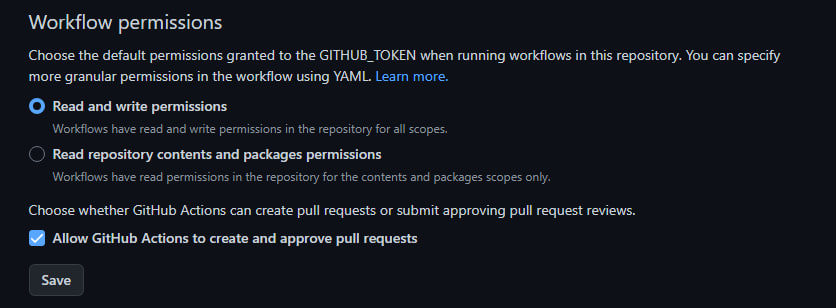

### React app template

# You can use it to create simple React applications

### You need to edit the homepage field in the package.json file by inserting your data according to the example below:

```javascript
"homepage": "https://DaniilPesotskyi.github.io/react-app-template",
```

### Also set the rights for correct work as shown in the example below:



### Install the project's base dependencies with the `npm install` command.

#### Start development mode by running the `npm start` command.